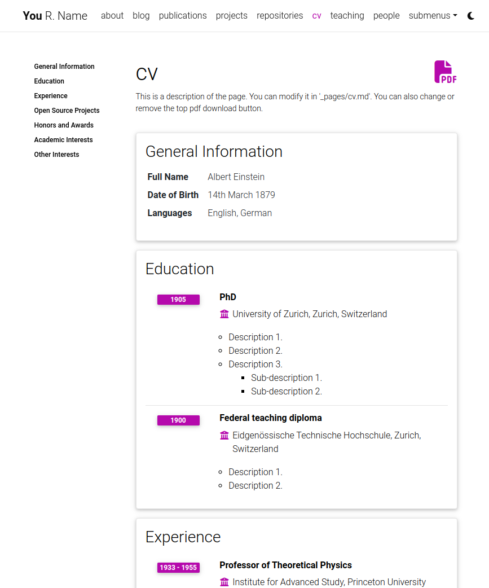

# Roberto Valenzuela Personal Portfolio

**Based on al-folio.**

## Installing and Deploying

For installation and deployment details please refer to [INSTALL.md](INSTALL.md).

```bash
$ docker compose up
```

## Features

### CV

There are currently 2 different ways of generating the CV page content. The first one is by using a json file located in [assets/json/resume.json](assets/json/resume.json). It is a [known standard](https://jsonresume.org/) for creating a CV programmatically. The second one, currently used as a fallback when the json file is not found, is by using a yml file located in [\_data/cv.yml](_data/cv.yml). This was the original way of creating the CV page content and since it is more human readable than a json file we decided to keep it as an option.

What this means is, if there is no resume data defined in [\_config.yml](_config.yml) and loaded via a json file, it will load the contents of [\_data/cv.yml](_data/cv.yml) as fallback.

[](https://alshedivat.github.io/al-folio/cv/)

---

### Collections

This Jekyll theme implements `collections` to let you break up your work into categories. The theme comes with two default collections: `news` and `projects`. Items from the `news` collection are automatically displayed on the home page. Items from the `projects` collection are displayed on a responsive grid on projects page.

[](https://alshedivat.github.io/al-folio/projects/)

You can easily create your own collections, apps, short stories, courses, or whatever your creative work is. To do this, edit the collections in the [\_config.yml](_config.yml) file, create a corresponding folder, and create a landing page for your collection, similar to `_pages/projects.md`.

---

### Layouts

**al-folio** comes with stylish layouts for pages and blog posts.

#### The iconic style of Distill

The theme allows you to create blog posts in the [distill.pub](https://distill.pub/) style:

[](https://alshedivat.github.io/al-folio/blog/2021/distill/)

For more details on how to create distill-styled posts using `<d-*>` tags, please refer to [the example](https://alshedivat.github.io/al-folio/blog/2021/distill/).

#### Full support for math & code

**al-folio** supports fast math typesetting through [MathJax](https://www.mathjax.org/) and code syntax highlighting using [GitHub style](https://github.com/jwarby/jekyll-pygments-themes). Also supports [chartjs charts](https://www.chartjs.org/), [mermaid diagrams](https://mermaid-js.github.io/mermaid/#/), and [TikZ figures](https://tikzjax.com/).

#### Photos, Audio, Video and more

Photo formatting is made simple using [Bootstrap's grid system](https://getbootstrap.com/docs/4.4/layout/grid/). Easily create beautiful grids within your blog posts and project pages, also with support for [video](https://alshedivat.github.io/al-folio/blog/2023/videos/) and [audio](https://alshedivat.github.io/al-folio/blog/2023/audios/) embeds:

<p align="center">
  <a href="https://alshedivat.github.io/al-folio/projects/1_project/">
    
  </a>
</p>

---

### Other features

#### Theming

A variety of beautiful theme colors have been selected for you to choose from. The default is purple, but you can quickly change it by editing the `--global-theme-color` variable in the `_sass/_themes.scss` file. Other color variables are listed there as well. The stock theme color options available can be found at [\_sass/\_variables.scss](_sass/_variables.scss). You can also add your own colors to this file assigning each a name for ease of use across the template.

---

#### Atom (RSS-like) Feed

It generates an Atom (RSS-like) feed of your posts, useful for Atom and RSS readers. The feed is reachable simply by typing after your homepage `/feed.xml`. E.g. assuming your website mountpoint is the main folder, you can type `yourusername.github.io/feed.xml`

---

#### Related posts

By default, there will be a related posts section on the bottom of the blog posts. These are generated by selecting the `max_related` most recent posts that share at least `min_common_tags` tags with the current post. If you do not want to display related posts on a specific post, simply add `related_posts: false` to the front matter of the post. If you want to disable it for all posts, simply set `enabled` to false in the `related_blog_posts` section in [\_config.yml](_config.yml).

---

#### Code quality checks

Currently, we run some checks to ensure that the code quality and generated site are good. The checks are done using GitHub Actions and the following tools:

- [Prettier](https://prettier.io/) - check if the formatting of the code follows the style guide
- [lychee](https://lychee.cli.rs/) - check for broken links
- [Axe](https://github.com/dequelabs/axe-core) (need to run manually) - do some accessibility testing

We decided to keep `Axe` runs manual because fixing the issues are not straightforward and might be hard for people without web development knowledge.

## FAQ

For frequently asked questions, please refer to [FAQ.md](FAQ.md).

<!-- markdownlint-restore -->
<!-- prettier-ignore-end -->

<!-- ALL-CONTRIBUTORS-LIST:END -->

## License

The theme is available as open source under the terms of the [MIT License](https://github.com/alshedivat/al-folio/blob/main/LICENSE).

Originally, **al-folio** was based on the [\*folio theme](https://github.com/bogoli/-folio) (published by [Lia Bogoev](https://liabogoev.com) and under the MIT license). Since then, it got a full re-write of the styles and many additional cool features.
